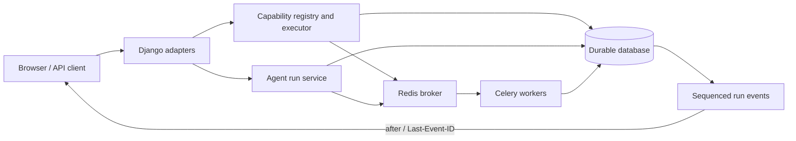

# Reliable Learning Workflows

A Django engineering showcase for long-running learning tasks. It demonstrates how an application can record work before dispatch, limit duplicate retries, recover stale runs, and replay progress after a browser reconnects. This is a sanitized snapshot of an internal application, with a new Git history and synthetic tests.

## How the pieces fit



The capability executor and agent run service are distinct paths. They share the principle that a request should have a durable identity and observable state before a worker performs long-running work.

| Concern | Implementation |
| --- | --- |
| Versioned operations | [`learning_apps/application/registry.py`](learning_apps/application/registry.py), [`capabilities/product_catalog.py`](learning_apps/application/capabilities/product_catalog.py), and [`learning_apps/adaptive_agent/tool_catalog.py`](learning_apps/adaptive_agent/tool_catalog.py) define 70+ capability specifications. A specification is not necessarily a Celery task. |
| Retry safety | [`learning_apps/application/executor.py`](learning_apps/application/executor.py) validates scope and input, uses persisted invocation records, and handles idempotent replay and lease reclamation. |
| Durable agent progress | [`learning_apps/adaptive_agent/run_service.py`](learning_apps/adaptive_agent/run_service.py) persists run transitions and requeues stale `running` or `resuming` runs. [`checkpoints.py`](learning_apps/adaptive_agent/checkpoints.py) and [`crypto.py`](learning_apps/adaptive_agent/crypto.py) protect saved SDK state. |
| Reconnectable progress | [`learning_apps/adaptive_agent/events.py`](learning_apps/adaptive_agent/events.py) assigns per-run event sequence numbers. [`api.py`](learning_apps/adaptive_agent/api.py) accepts `after` or `Last-Event-ID`; [`workspace.js`](static/js/agent/workspace.js) reconnects with its last cursor. |
| Background execution | [`learning_django/celery.py`](learning_django/celery.py), agent and product `tasks.py` files, and [`scripts/runtime`](scripts/runtime) separate web requests from worker execution. |

## Run locally

Use Python 3.10 or newer (the container uses 3.12). The sample local configuration uses SQLite and inline tasks, so Redis and provider credentials are unnecessary for the offline tests and basic web startup.

```bash
python3 -m venv .venv
source .venv/bin/activate
python -m pip install -r requirements.txt
cp .env.example .env
python manage.py migrate
python manage.py runserver
```

Open `http://127.0.0.1:8000/`. AI-backed actions require your own `OPENAI_API_KEY`. To exercise encrypted agent checkpoints, generate a local Fernet key with `python -c 'from cryptography.fernet import Fernet; print(Fernet.generate_key().decode())'` and set `LEARNING_AGENT_CHECKPOINT_ENCRYPTION_KEY` in your untracked `.env`.

The page loads MathJax from a pinned public CDN when it needs to display TeX. The server and offline tests work without that asset.

The bundled Bootstrap, Bootstrap Icons, and Chart.js assets retain their own MIT terms in [`THIRD_PARTY_NOTICES.txt`](THIRD_PARTY_NOTICES.txt).

For a separate web service and Celery workers, configure Redis and a **shared server database** in both processes, set `LEARNING_USE_CELERY=true`, migrate the database, then start the worker with `make worker`. SQLite is intended for local inline execution, not concurrent web and worker processes. The [`Dockerfile`](Dockerfile) packages the web service; [`scripts/runtime/start_worker.sh`](scripts/runtime/start_worker.sh) starts a worker from the same image with a different command.

## Verify

```bash
make check
```

This runs the repository secret-pattern scan, Ruff, the included offline tests, Django system checks, and a migration drift check. The focused tests in [`tests/integration/agent`](tests/integration/agent) cover capability execution, persistent runs, checkpoint and resume behavior, and SSE replay without calling a paid model.

## Scope and limits

- The published snapshot excludes credentials, customer records, deployment identifiers, private evaluation data, personal photos, and the source repository's historical commits.
- Checkpoint recovery resumes from saved SDK state. It does not promise continuation from every possible crash instruction. Idempotency controls repeated application invocations; external side effects still require their own protection.
- The tests exercise engineering behavior in a local environment. They do not establish production scale, learning outcomes, team size, or pilot participation. Deployment history and operational configuration are outside this snapshot.

The code is provided for portfolio review. No open-source license is granted by this repository.
